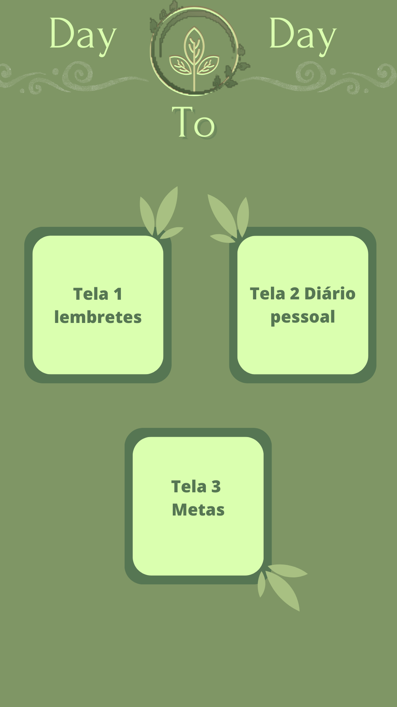
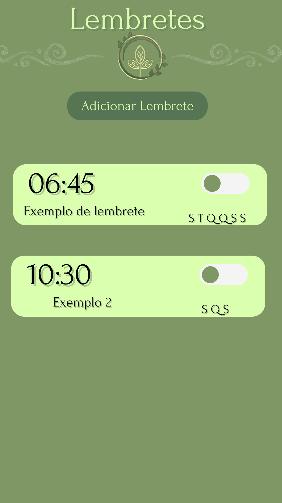
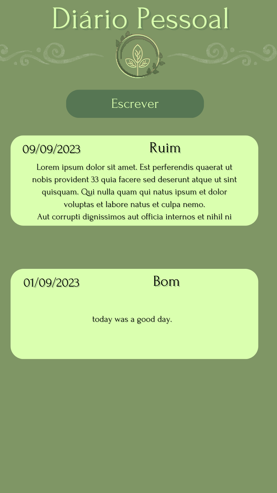
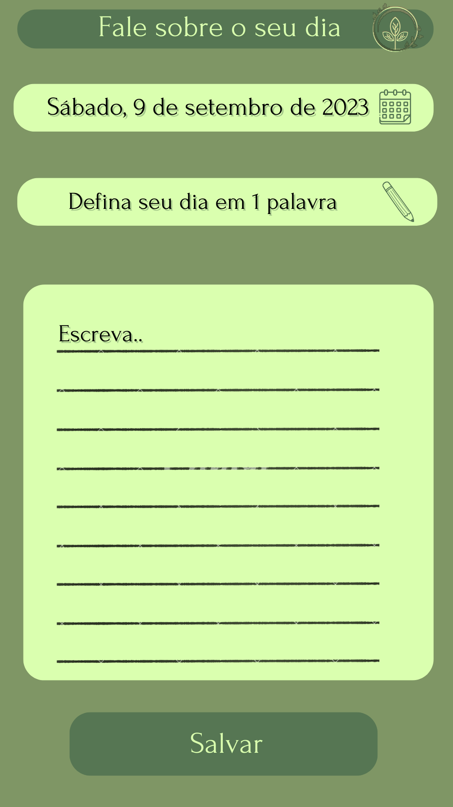
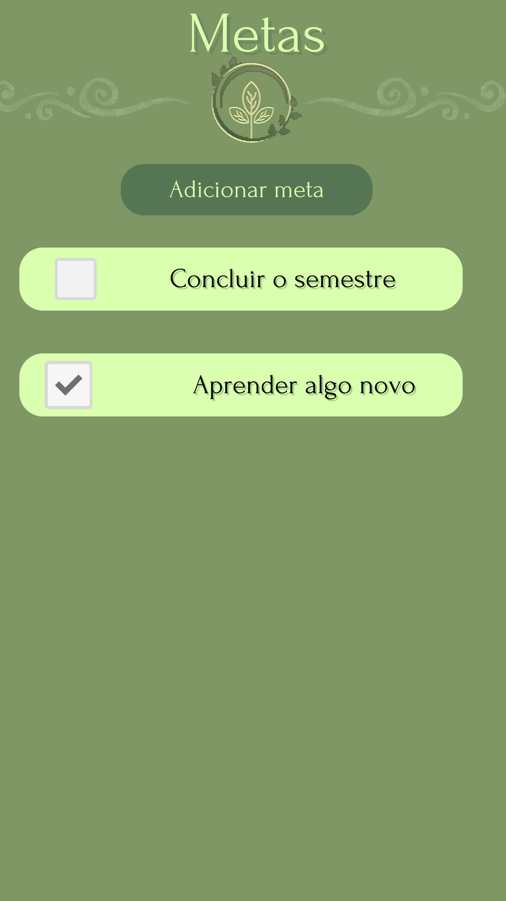

# appDayToDay
 Developing an android aplication for my mobile development classes, this app will serve as an everyday utility, there'll be a reminder screen, a personal diary section for journaling and a personal goals screen. The language that'll be used here is java.

# Screen samples

Main screen sample

Reminder screen sample

Journal screen sample

Journaling screen sample

Personal goals screen sample

